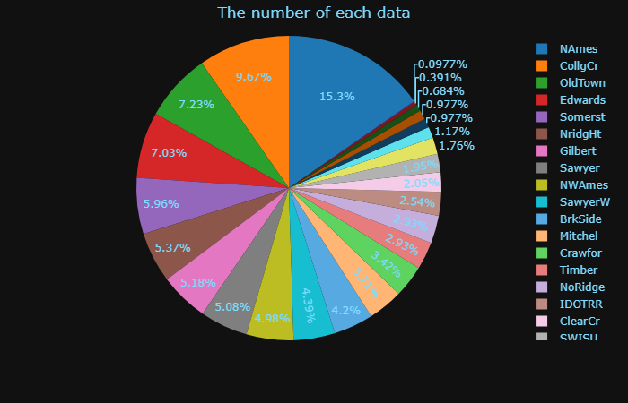
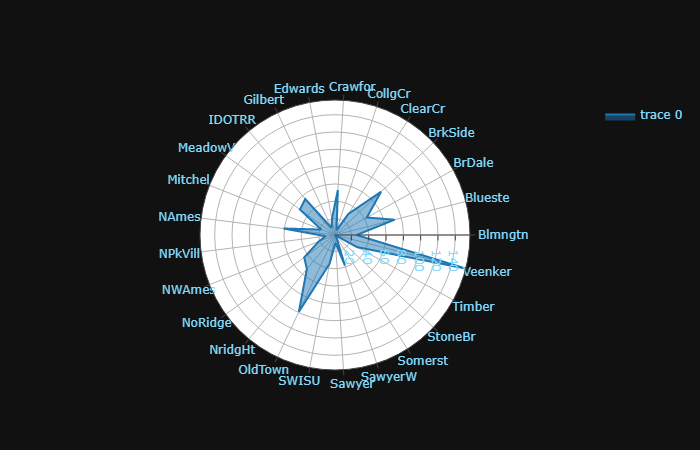
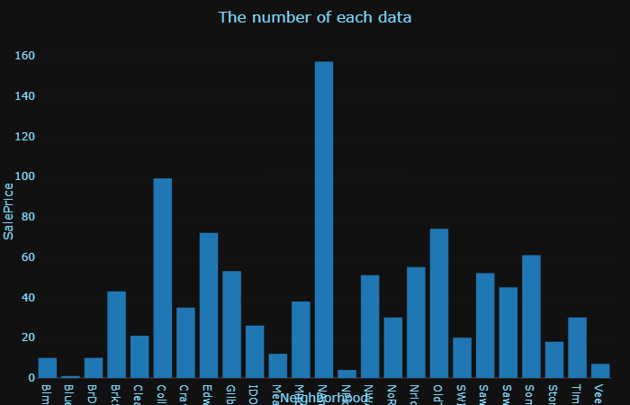
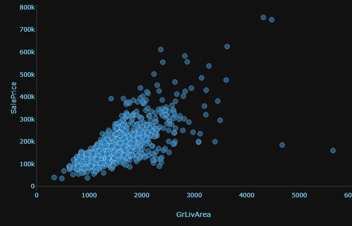

# datavisulization
this is the demonstration of Auto machine-learning and Exploration data analytic
## Usage
------
> 1. python dash5.py
> 2. http://127.0.0.1:8050/ on localhost

## Dependency
------
> python 2.7

> dash

> pandas

> numpy

> plotly

> json

## Example
------
> 

> 

> 

> 
